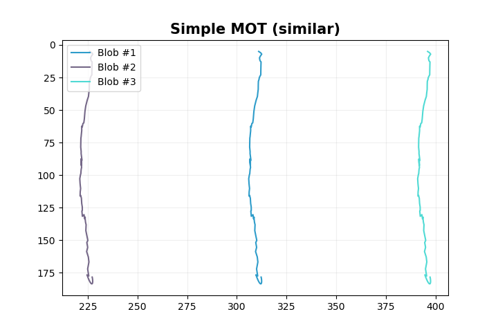
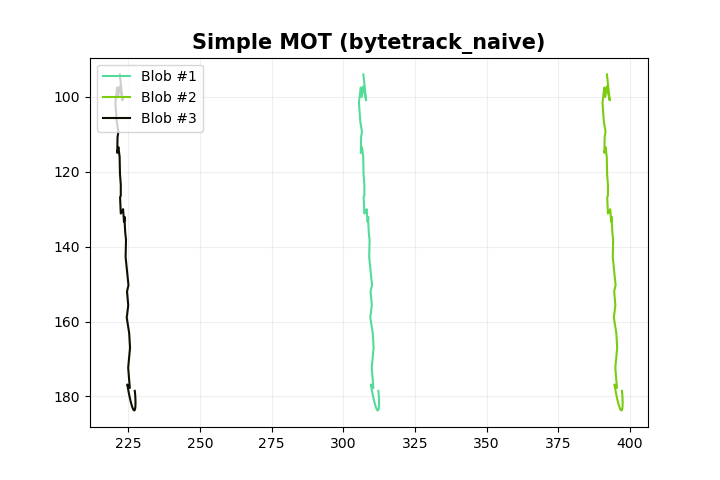
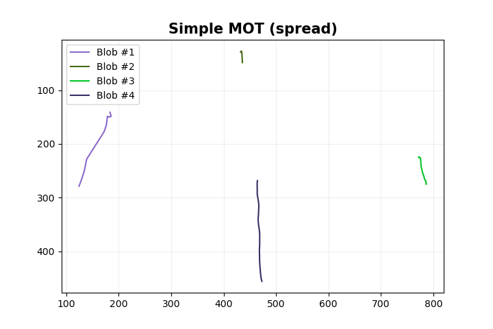
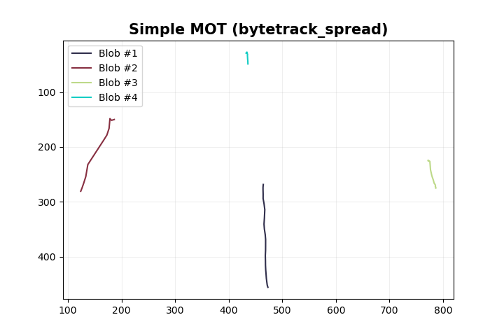

# Very naive implementation of Multi-object tracking in Go programming language
[](https://godoc.org/github.com/LdDl/mot-go)
[](https://sourcegraph.com/github.com/LdDl/mot-go?badge)
[](https://goreportcard.com/report/github.com/LdDl/mot-go)
[](https://github.com/LdDl/mot-go/releases)

## Table of Contents

- [About](#about)
- [How to use](#how-to-use)
- [References](#References)

## Breaking Changes (v0.4.0)

Trackers are now generic over the `Blob[Self]` interface, enabling custom blob implementations.

**Before:**
```go
tracker := mot.NewNewSimpleTracker(15.0, 5)
```

**After:**
```go
tracker := mot.NewNewSimpleTracker[*mot.SimpleBlob](15.0, 5)
```

This change enables custom blob implementations like `BlobBBox` (8-D Kalman filter tracking full bounding box dynamics) without duplicating tracker code.

## Blob Types

All trackers are generic over the `Blob` interface, so you can choose between two implementations:

| Type | State Dimensions | Kalman Filter | Use Case |
|------|-----------------|---------------|----------|
| `SimpleBlob` | 4D (x, y, vx, vy) | 2D position tracking | When you only need centroid tracking. Faster and simpler. |
| `BlobBBox` | 8D (cx, cy, w, h, vx, vy, vw, vh) | Full bbox tracking | When you need to track bounding box size changes (e.g., objects approaching/receding from camera). |

### SimpleBlob Usage

```go
tracker := mot.NewNewSimpleTracker[*mot.SimpleBlob](15.0, 5)
blob := mot.NewSimpleBlobWithTime(rect, dt)
```

### BlobBBox Usage

```go
tracker := mot.NewNewSimpleTracker[*mot.BlobBBox](15.0, 5)
blob := mot.NewBlobBBoxWithTime(rect, dt)

// Access velocity estimates (position and size velocities)
vx, vy, vw, vh := blob.GetVelocity()
```

Both blob types work with `SimpleTracker` and `ByteTracker`.

## About

This is my second attempt to create some pretty naive implementation of multi-object tracker. The first one was [gocv-blob](https://github.com/LdDl/gocv-blob).

This one uses similar approach to [this implementation](https://github.com/LdDl/mot-rs) in Rust programming language.


**What is this good for?**

You can use this library to track vehicles / peoples and etc. when you don't need that much accuracy or ReID.

**What Multi-Object tracking algorithms are implemented?**
- Centroids distance + diagonal - [mot/simple_tracker#38](mot/simple_tracker#38)
- [ByteTrack](https://arxiv.org/abs/2110.06864) using greedy matching algorithm - [mot/bytetrack.go#266](mot/bytetrack.go#266)
- [ByteTrack](https://arxiv.org/abs/2110.06864) using [Hungarian algorithm](https://en.wikipedia.org/wiki/Hungarian_algorithm) via [go-hungarian package](https://github.com/arthurkushman/go-hungarian) - [mot/bytetrack.go#231](mot/bytetrack.go#231)

**Are more advanced algorithms considered to be implemented in futher?**

Yes, I do think so. I guess that [SORT](https://arxiv.org/abs/1602.00763) or naive IoU tracker will be the next one.

If you want to you can contribute via opening [Pull Request](https://github.com/LdDl/mot-go/compare)

**Some examples**

### SimpleBlob (centroid tracking)

Simple tracker for dense tracks |  ByteTrack for dense tracks
:-------------------------:|:-------------------------:
  |  

Simple tracker for spread tracks |  ByteTrack for spread tracks
:-------------------------:|:-------------------------:
  |  

### BlobBBox (bounding box tracking)

Simple tracker for dense tracks |  ByteTrack for dense tracks
:-------------------------:|:-------------------------:
  |  

Simple tracker for spread tracks |  ByteTrack for spread tracks
:-------------------------:|:-------------------------:
  |  

## How to use

Add dependency into your project:
```shell
go get github.com/LdDl/mot-go
```

Let's create really synthetic example and define similar trajectories for three objects.
We're using pretty simple MOT algorithm, so no hard tasks for now.

```go
package main

import (
	"encoding/csv"
	"fmt"
	"os"
	"strings"

	"github.com/LdDl/mot-go/mot"
)

func main() {
	bboxesOne := [][]float64{[]float64{236, -25, 386, 35}, []float64{237, -24, 387, 36}, []float64{238, -22, 388, 38}, []float64{236, -20, 386, 40}, []float64{236, -19, 386, 41}, []float64{237, -18, 387, 42}, []float64{237, -18, 387, 42}, []float64{238, -17, 388, 43}, []float64{237, -14, 387, 46}, []float64{237, -14, 387, 46}, []float64{237, -12, 387, 48}, []float64{237, -12, 387, 48}, []float64{237, -11, 387, 49}, []float64{237, -11, 387, 49}, []float64{237, -10, 387, 50}, []float64{237, -10, 387, 50}, []float64{237, -8, 387, 52}, []float64{237, -8, 387, 52}, []float64{236, -7, 386, 53}, []float64{236, -7, 386, 53}, []float64{236, -6, 386, 54}, []float64{236, -6, 386, 54}, []float64{236, -2, 386, 58}, []float64{235, 0, 385, 60}, []float64{236, 2, 386, 62}, []float64{236, 5, 386, 65}, []float64{236, 9, 386, 69}, []float64{235, 12, 385, 72}, []float64{235, 14, 385, 74}, []float64{233, 16, 383, 76}, []float64{232, 26, 382, 86}, []float64{233, 28, 383, 88}, []float64{233, 40, 383, 100}, []float64{233, 30, 383, 90}, []float64{232, 22, 382, 82}, []float64{232, 34, 382, 94}, []float64{232, 21, 382, 81}, []float64{233, 40, 383, 100}, []float64{232, 40, 382, 100}, []float64{232, 40, 382, 100}, []float64{232, 36, 382, 96}, []float64{232, 53, 382, 113}, []float64{232, 50, 382, 110}, []float64{233, 55, 383, 115}, []float64{232, 50, 382, 110}, []float64{234, 68, 384, 128}, []float64{231, 49, 381, 109}, []float64{232, 68, 382, 128}, []float64{231, 31, 381, 91}, []float64{232, 64, 382, 124}, []float64{233, 71, 383, 131}, []float64{231, 64, 381, 124}, []float64{231, 74, 381, 134}, []float64{231, 64, 381, 124}, []float64{230, 77, 380, 137}, []float64{232, 82, 382, 142}, []float64{232, 78, 382, 138}, []float64{232, 78, 382, 138}, []float64{231, 79, 381, 139}, []float64{231, 79, 381, 139}, []float64{231, 91, 381, 151}, []float64{232, 78, 382, 138}, []float64{232, 78, 382, 138}, []float64{233, 90, 383, 150}, []float64{232, 92, 382, 152}, []float64{232, 92, 382, 152}, []float64{233, 98, 383, 158}, []float64{232, 100, 382, 160}, []float64{231, 92, 381, 152}, []float64{233, 110, 383, 170}, []float64{234, 92, 384, 152}, []float64{234, 92, 384, 152}, []float64{234, 110, 384, 170}, []float64{234, 92, 384, 152}, []float64{233, 104, 383, 164}, []float64{234, 111, 384, 171}, []float64{234, 106, 384, 166}, []float64{234, 106, 384, 166}, []float64{233, 124, 383, 184}, []float64{236, 125, 386, 185}, []float64{236, 125, 386, 185}, []float64{232, 120, 382, 180}, []float64{236, 131, 386, 191}, []float64{232, 132, 382, 192}, []float64{238, 139, 388, 199}, []float64{236, 141, 386, 201}, []float64{232, 151, 382, 211}, []float64{236, 145, 386, 205}, []float64{236, 145, 386, 205}, []float64{231, 133, 381, 193}, []float64{237, 148, 387, 208}, []float64{237, 148, 387, 208}, []float64{237, 148, 387, 208}, []float64{237, 148, 387, 208}, []float64{237, 148, 387, 208}, []float64{237, 148, 387, 208}, []float64{237, 148, 387, 208}, []float64{237, 148, 387, 208}, []float64{237, 148, 387, 208}, []float64{237, 148, 387, 208}, []float64{237, 148, 387, 208}, []float64{237, 148, 387, 208}, []float64{237, 148, 387, 208}, []float64{237, 148, 387, 208}, []float64{237, 148, 387, 208}, []float64{237, 148, 387, 208}, []float64{237, 148, 387, 208}, []float64{237, 148, 387, 208}, []float64{237, 148, 387, 208}, []float64{237, 148, 387, 208}, []float64{237, 148, 387, 208}, []float64{237, 148, 387, 208}}
	bboxesTwo := [][]float64{[]float64{321, -25, 471, 35}, []float64{322, -24, 472, 36}, []float64{323, -22, 473, 38}, []float64{321, -20, 471, 40}, []float64{321, -19, 471, 41}, []float64{322, -18, 472, 42}, []float64{322, -18, 472, 42}, []float64{323, -17, 473, 43}, []float64{322, -14, 472, 46}, []float64{322, -14, 472, 46}, []float64{322, -12, 472, 48}, []float64{322, -12, 472, 48}, []float64{322, -11, 472, 49}, []float64{322, -11, 472, 49}, []float64{322, -10, 472, 50}, []float64{322, -10, 472, 50}, []float64{322, -8, 472, 52}, []float64{322, -8, 472, 52}, []float64{321, -7, 471, 53}, []float64{321, -7, 471, 53}, []float64{321, -6, 471, 54}, []float64{321, -6, 471, 54}, []float64{321, -2, 471, 58}, []float64{320, 0, 470, 60}, []float64{321, 2, 471, 62}, []float64{321, 5, 471, 65}, []float64{321, 9, 471, 69}, []float64{320, 12, 470, 72}, []float64{320, 14, 470, 74}, []float64{318, 16, 468, 76}, []float64{317, 26, 467, 86}, []float64{318, 28, 468, 88}, []float64{318, 40, 468, 100}, []float64{318, 30, 468, 90}, []float64{317, 22, 467, 82}, []float64{317, 34, 467, 94}, []float64{317, 21, 467, 81}, []float64{318, 40, 468, 100}, []float64{317, 40, 467, 100}, []float64{317, 40, 467, 100}, []float64{317, 36, 467, 96}, []float64{317, 53, 467, 113}, []float64{317, 50, 467, 110}, []float64{318, 55, 468, 115}, []float64{317, 50, 467, 110}, []float64{319, 68, 469, 128}, []float64{316, 49, 466, 109}, []float64{317, 68, 467, 128}, []float64{316, 31, 466, 91}, []float64{317, 64, 467, 124}, []float64{318, 71, 468, 131}, []float64{316, 64, 466, 124}, []float64{316, 74, 466, 134}, []float64{316, 64, 466, 124}, []float64{315, 77, 465, 137}, []float64{317, 82, 467, 142}, []float64{317, 78, 467, 138}, []float64{317, 78, 467, 138}, []float64{316, 79, 466, 139}, []float64{316, 79, 466, 139}, []float64{316, 91, 466, 151}, []float64{317, 78, 467, 138}, []float64{317, 78, 467, 138}, []float64{318, 90, 468, 150}, []float64{317, 92, 467, 152}, []float64{317, 92, 467, 152}, []float64{318, 98, 468, 158}, []float64{317, 100, 467, 160}, []float64{316, 92, 466, 152}, []float64{318, 110, 468, 170}, []float64{319, 92, 469, 152}, []float64{319, 92, 469, 152}, []float64{319, 110, 469, 170}, []float64{319, 92, 469, 152}, []float64{318, 104, 468, 164}, []float64{319, 111, 469, 171}, []float64{319, 106, 469, 166}, []float64{319, 106, 469, 166}, []float64{318, 124, 468, 184}, []float64{321, 125, 471, 185}, []float64{321, 125, 471, 185}, []float64{317, 120, 467, 180}, []float64{321, 131, 471, 191}, []float64{317, 132, 467, 192}, []float64{323, 139, 473, 199}, []float64{321, 141, 471, 201}, []float64{317, 151, 467, 211}, []float64{321, 145, 471, 205}, []float64{321, 145, 471, 205}, []float64{316, 133, 466, 193}, []float64{322, 148, 472, 208}, []float64{322, 148, 472, 208}, []float64{322, 148, 472, 208}, []float64{322, 148, 472, 208}, []float64{322, 148, 472, 208}, []float64{322, 148, 472, 208}, []float64{322, 148, 472, 208}, []float64{322, 148, 472, 208}, []float64{322, 148, 472, 208}, []float64{322, 148, 472, 208}, []float64{322, 148, 472, 208}, []float64{322, 148, 472, 208}, []float64{322, 148, 472, 208}, []float64{322, 148, 472, 208}, []float64{322, 148, 472, 208}, []float64{322, 148, 472, 208}, []float64{322, 148, 472, 208}, []float64{322, 148, 472, 208}, []float64{322, 148, 472, 208}, []float64{322, 148, 472, 208}, []float64{322, 148, 472, 208}, []float64{322, 148, 472, 208}}
	bboxesThree := [][]float64{[]float64{151, -25, 301, 35}, []float64{152, -24, 302, 36}, []float64{153, -22, 303, 38}, []float64{151, -20, 301, 40}, []float64{151, -19, 301, 41}, []float64{152, -18, 302, 42}, []float64{152, -18, 302, 42}, []float64{153, -17, 303, 43}, []float64{152, -14, 302, 46}, []float64{152, -14, 302, 46}, []float64{152, -12, 302, 48}, []float64{152, -12, 302, 48}, []float64{152, -11, 302, 49}, []float64{152, -11, 302, 49}, []float64{152, -10, 302, 50}, []float64{152, -10, 302, 50}, []float64{152, -8, 302, 52}, []float64{152, -8, 302, 52}, []float64{151, -7, 301, 53}, []float64{151, -7, 301, 53}, []float64{151, -6, 301, 54}, []float64{151, -6, 301, 54}, []float64{151, -2, 301, 58}, []float64{150, 0, 300, 60}, []float64{151, 2, 301, 62}, []float64{151, 5, 301, 65}, []float64{151, 9, 301, 69}, []float64{150, 12, 300, 72}, []float64{150, 14, 300, 74}, []float64{148, 16, 298, 76}, []float64{147, 26, 297, 86}, []float64{148, 28, 298, 88}, []float64{148, 40, 298, 100}, []float64{148, 30, 298, 90}, []float64{147, 22, 297, 82}, []float64{147, 34, 297, 94}, []float64{147, 21, 297, 81}, []float64{148, 40, 298, 100}, []float64{147, 40, 297, 100}, []float64{147, 40, 297, 100}, []float64{147, 36, 297, 96}, []float64{147, 53, 297, 113}, []float64{147, 50, 297, 110}, []float64{148, 55, 298, 115}, []float64{147, 50, 297, 110}, []float64{149, 68, 299, 128}, []float64{146, 49, 296, 109}, []float64{147, 68, 297, 128}, []float64{146, 31, 296, 91}, []float64{147, 64, 297, 124}, []float64{148, 71, 298, 131}, []float64{146, 64, 296, 124}, []float64{146, 74, 296, 134}, []float64{146, 64, 296, 124}, []float64{145, 77, 295, 137}, []float64{147, 82, 297, 142}, []float64{147, 78, 297, 138}, []float64{147, 78, 297, 138}, []float64{146, 79, 296, 139}, []float64{146, 79, 296, 139}, []float64{146, 91, 296, 151}, []float64{147, 78, 297, 138}, []float64{147, 78, 297, 138}, []float64{148, 90, 298, 150}, []float64{147, 92, 297, 152}, []float64{147, 92, 297, 152}, []float64{148, 98, 298, 158}, []float64{147, 100, 297, 160}, []float64{146, 92, 296, 152}, []float64{148, 110, 298, 170}, []float64{149, 92, 299, 152}, []float64{149, 92, 299, 152}, []float64{149, 110, 299, 170}, []float64{149, 92, 299, 152}, []float64{148, 104, 298, 164}, []float64{149, 111, 299, 171}, []float64{149, 106, 299, 166}, []float64{149, 106, 299, 166}, []float64{148, 124, 298, 184}, []float64{151, 125, 301, 185}, []float64{151, 125, 301, 185}, []float64{147, 120, 297, 180}, []float64{151, 131, 301, 191}, []float64{147, 132, 297, 192}, []float64{153, 139, 303, 199}, []float64{151, 141, 301, 201}, []float64{147, 151, 297, 211}, []float64{151, 145, 301, 205}, []float64{151, 145, 301, 205}, []float64{146, 133, 296, 193}, []float64{152, 148, 302, 208}, []float64{152, 148, 302, 208}, []float64{152, 148, 302, 208}, []float64{152, 148, 302, 208}, []float64{152, 148, 302, 208}, []float64{152, 148, 302, 208}, []float64{152, 148, 302, 208}, []float64{152, 148, 302, 208}, []float64{152, 148, 302, 208}, []float64{152, 148, 302, 208}, []float64{152, 148, 302, 208}, []float64{152, 148, 302, 208}, []float64{152, 148, 302, 208}, []float64{152, 148, 302, 208}, []float64{152, 148, 302, 208}, []float64{152, 148, 302, 208}, []float64{152, 148, 302, 208}, []float64{152, 148, 302, 208}, []float64{152, 148, 302, 208}, []float64{152, 148, 302, 208}, []float64{152, 148, 302, 208}, []float64{152, 148, 302, 208}}
	tracker := mot.NewNewSimpleTracker[*mot.SimpleBlob](15.0, 5)
	dt := 1.0 / 25.0 // emulate 25 fps

	for idx := range bboxesOne {
		rectOne := mot.NewRect(bboxesOne[idx][0], bboxesOne[idx][1], bboxesOne[idx][2]-bboxesOne[idx][0], bboxesOne[idx][3]-bboxesOne[idx][1])
		rectTwo := mot.NewRect(bboxesTwo[idx][0], bboxesTwo[idx][1], bboxesTwo[idx][2]-bboxesTwo[idx][0], bboxesTwo[idx][3]-bboxesTwo[idx][1])
		rectThree := mot.NewRect(bboxesThree[idx][0], bboxesThree[idx][1], bboxesThree[idx][2]-bboxesThree[idx][0], bboxesThree[idx][3]-bboxesThree[idx][1])

		blobOne := mot.NewSimpleBlobWithTime(rectOne, dt)
		blobTwo := mot.NewSimpleBlobWithTime(rectTwo, dt)
		blobThree := mot.NewSimpleBlobWithTime(rectThree, dt)
		blobs := []*mot.SimpleBlob{blobOne, blobTwo, blobThree}
		err := tracker.MatchObjects(blobs)
		if err != nil {
			fmt.Println(err)
			return
		}
	}

	file, err := os.Create("blobs_naive.csv")
	if err != nil {
		fmt.Println(err)
		return
	}
	defer file.Close()

	writer := csv.NewWriter(file)
	defer writer.Flush()
	writer.Comma = ';'

	err = writer.Write([]string{"id", "track"})
	if err != nil {
		fmt.Println(err)
		return
	}

	for objectID, object := range tracker.Objects {
		track := object.GetTrack()
		data := make([]string, len(track))
		for idx, pt := range track {
			data[idx] = fmt.Sprintf("%f,%f", pt.X, pt.Y)
		}
		dataStr := strings.Join(data, "|")
		err = writer.Write([]string{objectID.String(), dataStr})
		if err != nil {
			fmt.Println(err)
			return
		}
	}
}

```

If we plot results of filtered tracks we should get something like:

Similar (for code example above)            |  Spread
:-------------------------:|:-------------------------:
  |  

<p style="text-align: center;"><i>Trajectories</i></p>

## References
- [Implementation of Kalman filter, Dimitrii Lopanov, 2023](https://github.com/LdDl/kalman-filter#implementation-of-discrete-kalman-filter-for-object-tracking-purposes)
- [Wikipedia](https://en.wikipedia.org/wiki/Multiple_object_tracking)
